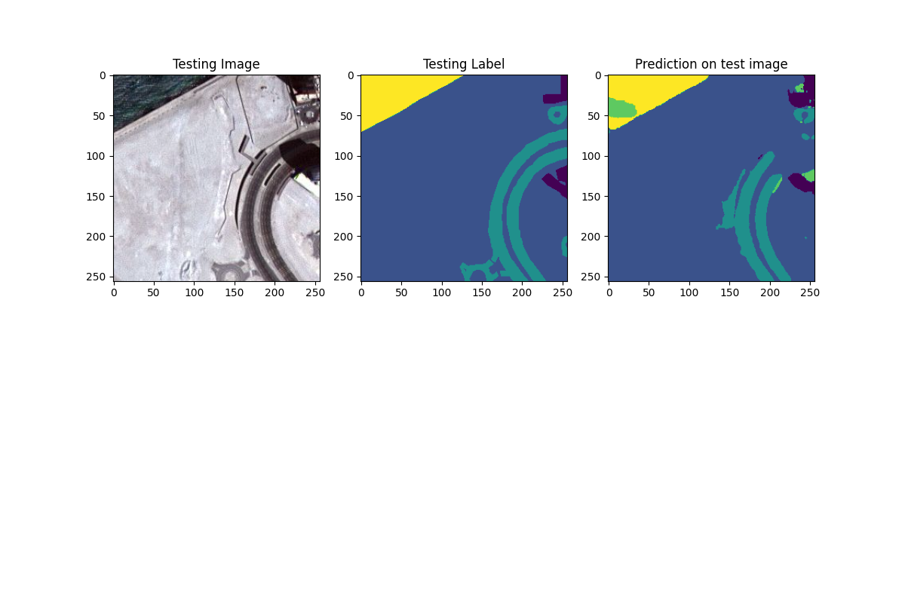
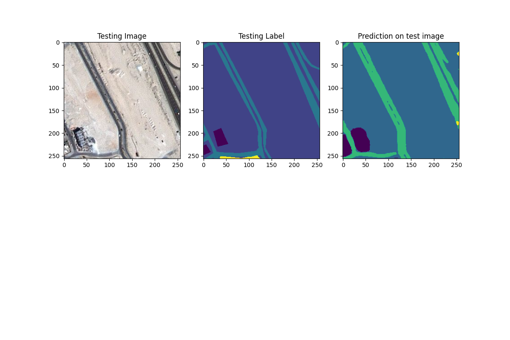
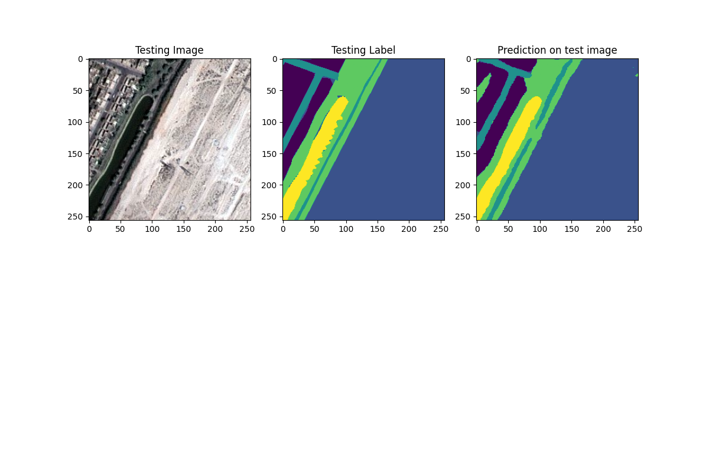
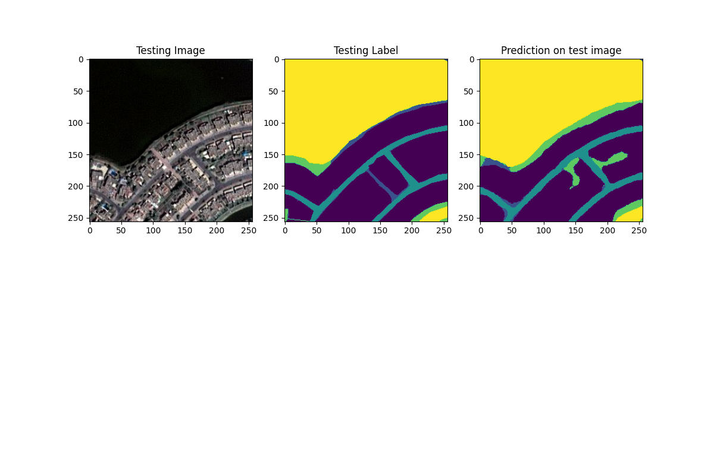

### Group 8: Stephen Ebrahim and Ebram Mekhail

# Milestone 2: Perform Baseline Semantic Segmentation

## Part 2: U-Net Explanation (Including Figures)

### Overview:

The paper written by Ronneberger et al. (2015) describes how there is a limitation in the field of deep networks where a massive dataset is required to achieve tolerable results, and due to the shortage of clean and labeled data, makes it significantly more complicated. However, in the paper, it is argued that through clever data processing and enhancement, such limitations can be avoided. The paper describes an architecture (U-net) that is applied to Biomedical Image Segmentation - but is also applicable to other image segmentation such as the semantic segmentation of satellite imagery in our project.

A central idea that the paper focuses on is image classification. Generally, convolutional networks are used in image classification to classify the image as a whole; for instance, if we wanted to determine whether or not an image contained an animal, the output would be either 0 (does not exist) or 1 (exists) - for the entire image. However, what if we wanted to focus on certain aspects in one image and classify that? The paper terms this idea as "localization" where the desired output has various parts of the image labeled. For instance, in the semantic segmentation of satellite imagery, parts of the image will contain roads, deserts, houses, a body of water, etc. The paper focuses on this idea and creates a "fully convolutional network" architecture where it solves this scenario magnificently.

### Figures

U-Net Network Architecture:

The figure above represents the architecture for the U-Net architecture designed by Ronneberger et al. in their paper U-Net: Convolutional Networks for Biomedical Image Segmentation [1]; it gets its name from its U-like shape.

To begin, the top left of the U-Net represents the input layer - as it can be seen, the inputted image tile in the figure above is of size 572 x 572 pixels. As the input goes down the U-shaped architecture (called contracting path), it gets contracted. This contraction consists of a 3x3 convolution ReLU and then a 2x2 max pooling or downsampling. This convolution acts like a filter that can be applied to make the image smaller or larger and it does so by utilizing certain pixels along the way; this influences how the image turns out to be. ReLU (Recitified Linear Unit) which is frequently used due to its simple and linear nature:
$$ ReLU(x) = max(0, x)$$

Max pooling refers to the idea of only considering the most significant pixels in a region, consequently, this substantially reduces the sample size while strictly focusing on the decisive aspects of the image tile. The following figure depicts this idea:

 
https://production-media.paperswithcode.com/methods/MaxpoolSample2.png

This process is repeated until the bottom of the U-path. Then the opposite happens when following the path up the U-shape (expansive path). The difference here is that up-convolution or upsampling is performed, which is the opposite idea of max pooling; essentially, the significant portions that we captured from Max pooling are generalized to create a bigger image.

Finally, the last and perhaps the most significant element in the U-Net architecture is the copy and crop path. It can be inferred from the previous step, it could be very challenging to try to generalize the area around where up-convolution or upsampling occurs. In other words, it is more difficult to retrieve the lost information that happened from max pooling, upsampling on its own is not sufficient. Consequently, this is why the U-Net architecture uses the copy and crop strategy. The functionality provided by this accounts for the lost/too generalized portions of the image tile that surround a convolution result. As mentioned, since the paper focused largely on localization, this feature is crucial in successfully creating image segmentation.

### References:

[1] U-Net: Convolutional Networks for Biomedical Image Segmentation
Olaf Ronneberger, Philipp Fischer, Thomas Brox (May, 2015)
https://arxiv.org/abs/1505.04597

 

 

## Part 2 (Cont'd): Results [epochs = 100]

To give an overview of how the model performs, the first thing to show from the results is the Training and Validation IoU (Intersection of Union). IoU refers to how much two images intersect; for instance, if two images where stacked on top of each other, the pixels that match are considered the intersection of the union of the two images. Thus, if we want the model to perform well, this value needs to be maximized. The way we calculate this value is through Jaccard's Coefficient. Which can be calculated as the following:
$$J(A, B)=\frac{\left|A \cap B\right|}{\left|A \cup B\right|}$$

Where $A, B$ represents the set of the image as a 1D array.

From this graph, we can observe that both the training and validation IoU are increasing with the number of epochs. Initially, it is a large jump in accuracy but soon thereafter there is slow improvement. To further support this, here is the graph of the Training and Validation Loss.

Again, we reduce the loss drastically initially, then it stabilizes and does not improve by much.

10 segmented images produced by the model are in the docs directory, however, here are some to represent how the model is doing:

From the two images above, the prediction on the test images seems to be performing well to a certain extent, most of the important features are there. The first one is very accurate, and the second one is somewhat accurate (the shape is present). However, in some situations the model is very inaccurate, such as the following:

This supports the final value we acquired for IoU for validation after 100 epochs which are around 0.26; although this might seem very low, considering the small dataset and other conditions, it is adequate.
