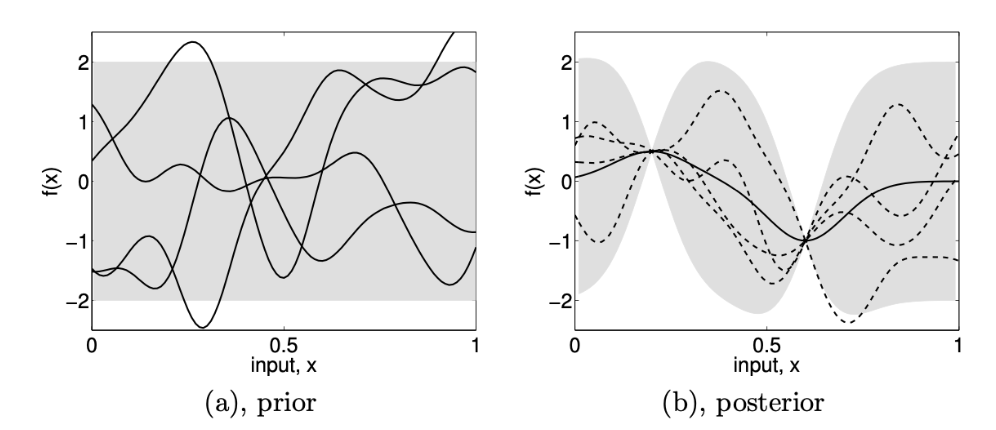
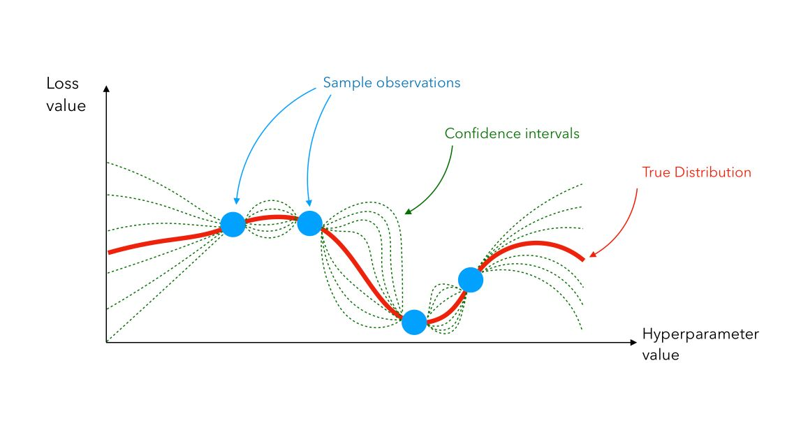

### Group 8: Stephen Ebrahim and Ebram Mekhail

# Milestone 3: Hyper-Parameter Optimization (HPO)

### Overview of HPO:

When training a model, there are usually different parameters that can be adjusted to produce different results. In a very simple model, this variability may be little and can probably be tested exhaustively (iterating through all possibilities). However, in a more complicated model, there can be a plethora of different variables to consider where an exhaustive approach to finding the optimal results is nearly impossible; Hyper-Parameter Optimization is the study of this issue. To give a simple example, imagine a decision tree that only considers various numbers of epochs while training the model; it is trivial to run the training for a different amount of epochs and observe at what epoch the model stops improving. Now, imagine the same decision tree, but this time it considers epochs, max depth, different criteria, type of loss function, etc. It becomes exponentially more difficult to accurately depict the best combination that would produce optimal results. Through the study of HPO techniques, this crucial combination of parameters can be acquired.

In the paper titled _Algorithms for Hyper-Parameter Optimization_ by Bergstra et al. (2011), various HPO techniques and algorithms are discussed to improve performance regarding image classification. A critical idea argued is that the performance of a model is greatly influenced by the parameters used to train the model. The paper states that learning these parameters is important and should be treated as an "outer loop in the learning process" (Bergstra et al. 2011). For instance, a complicated model will not only perform well due to its complex nature but also due to valuable parameters aiding the learning process.

### Gaussian Process (GP) Method:

The paper written by Rasmussen titled _Gaussian Processes in Machine Learning_ (2004) does a great job of introducing the idea of Gaussian Processes in machine learning and how using such techniques can help identify hyper-parameters. The general idea of Gaussian Processes is to produce numerous functions that try to fit a dataset. Although Gaussian Process can be extremely complicated, in the paper it is very simply modeled as

$$f ∼ \mathcal{GP}(m, k),$$

where the function $f$ represents the output of the distribution produced by the Gaussian Process using the function $m$ for mean and the function $k$ for covariance (Rasmussen 2004).

Initially, these functions can be very noisy without real meaning and would not fit the dataset well. However, as examples from a dataset are added, these functions adjust accordingly to try to make an accurate model. Observe the following figure

   
  Gaussian Processes for Machine Learning by Carl Edward Rasmussen and Christopher K. I. Williams (2004)

On the left is the initial state which is called "prior" and it contains all the functions that will be used to estimate the dataset without there being any data for the functions to adjust to yet. On the right-hand side, we have the "posterior" graph which includes a great deal of information to dissect. The following figure is a more descriptive depiction of this graph.

   
  A Guide to Hyper-Parameter Optimization (HPO), Maël Fabien (2019)
  https://maelfabien.github.io/machinelearning/Explorium4

The dotted curves are a collection of functions that give an estimate of how the data may be represented. Through a large amount of these functions, the true distribution - which is shown as the red line - can be computed through their average. Moreover, these functions are extremely useful because they also give confidence intervals which show that as the values get away from a converging point (a sample observation) then the probability of error increases.

Perhaps the most significant component to analyze in that figure is the sample observation (blue points) and how the functions adjust to that. As the data points are added, then the model can be sure that there is a point in that specific location (depending on the input), consequently, all the models will converge at that point. However, what if there is an abundance of points already present? How will the model choose a point to adjust all the functions to? The model will manage this issue effectively by considering the unexplored or low-certainty areas (Fabien, 2019). Doing this ensures that the model will give the best estimate to all the data points and accurately find the right combination of hyper-parameters that produce optimal results.

### References:

[1] Algorithms for Hyper-Parameter Optimization (2011)
James Bergstra, Rémi Bardenet, Yoshua Bengio, Balázs Kégl
https://proceedings.neurips.cc/paper/2011/file/86e8f7ab32cfd12577bc2619bc635690-Paper.pdf

[2] Gaussian Processes in Machine Learning (2004)
Carl Edward Rasmussen
https://link.springer.com/chapter/10.1007/978-3-540-28650-9_4

[3] A Guide to Hyper-Parameter Optimization (HPO) (2019)
Maël Fabien
https://maelfabien.github.io/machinelearning/Explorium4
