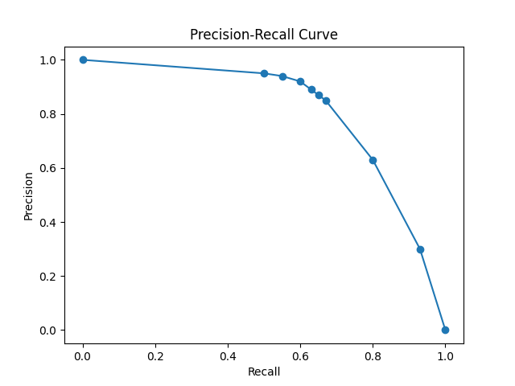
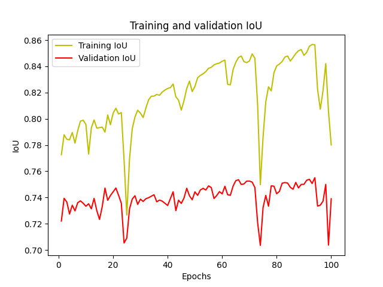
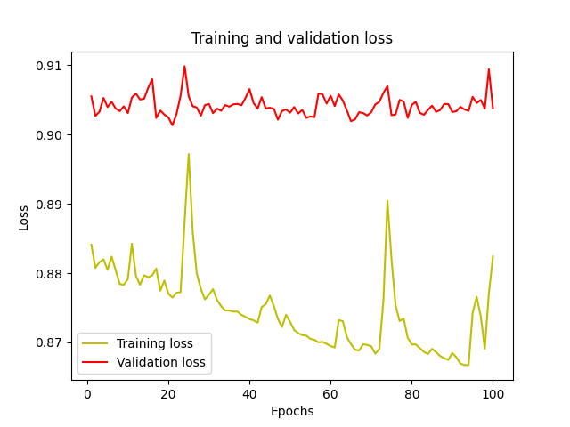

### Group 8: Stephen Ebrahim and Ebram Mekhail

# Milestone 4: Model Compression

### Overview of Model Compression:

As it has been observed from the Gradient Boosting algorithm, using a plethora of models to construct a model proves to be very accurate - this is true for all ensemble techniques. The Ensemble Predictions technique involves the usage of multiple weak models that support each other and ultimately together form an accurate model. In other words, all of the models have a unique pattern that it has observed, and together these models combine their "knowledge" in a way to formulate one well-rounded versatile model which produces exceptional results. However, it is evident that the abundance of these models proves to be very costly in computation for regular consumers that do not have expensive and powerful machines. Subsequently, because this is a major issue, there have been numerous approaches in attempting to deal with it through some sort of model compression technique. The paper by Hinton et al. titled _Distilling the Knowledge in a Neural Network (2015)_ does a great job describing and addressing this issue.

Hinton et al. use a clever analogy of insects and their larvae to relate it to how their technique is developed and how it operates. When an insect is in its larva stage, the larval shell forms according to its surrounding environment and it is optimized in a way so that it strives in that specific environment. Essentially, in that stage, the insect will build its own environment (the shell) to account for the surrounding conditions. The technique that is developed in the paper uses a similar idea; the model will have two separate environments, one for development, and one for deployment. The deployment stage will extract the "knowledge" attained from the development stage without having to go through the expensive computations and training that is experienced there.

### Knowledge Distillation (KD):

Knowledge Distillation refers to the idea discussed above; the model that will be used in production is a simple model that attempts to get as much of the valuable information in the complicated trained model while remaining straightforward. The following figure is an exceptional example that illustrates the knowledge distillation idea in terms of Neural Networks.

   
  Knowledge Distillation: A Survey, Gou et al. (2020)
  https://arxiv.org/abs/2006.05525

This figure is from a paper called _Knowledge Distillation: A Survey_ by Gou et al. (2020). Since the teacher has a substantial amount of knowledge, it is considered the more complicated training model. The student, on the other hand, is the simpler model that is attempting to retain as much information as possible without making it too complicated for them to understand.

A central idea in Distillation is the use of "soft-max" which in short, is a function that takes in a logit and produces a probability for each of the class presents. The following equation from the paper by Hinton et al. depicts this idea.
$$q_i-\frac{exp(z_i/T)}{\sum_jexp(z_j/T)}$$
where $q_i$ represents the probability, $z_i, z_j$ represents the logits, and $T$ is the "temperature" which is normally set to 1 and is used to control the softness of the probability distribution.

Essentially, soft-max will take in a vector in the training process and produce a vector of probabilities. This vector of probabilities represents the impact imposed by that vector on the model and training process. Assigning a value to this impact (the probability) gives a good estimate of whether or not this specific part of the model should be factored into the model that will be used for production. Another way to think about it is that if the probability is high, then that specific part of the model should be distilled and then transferred into the simpler model.

The temperature is an important factor in distilling the model because it helps with how the model picks up information in a sense. As mentioned earlier, the temperature $T$ helps with "softening" in the soft-max functions. The reason this is important is that it helps the model choose what to distill easier. In a sense, if there are a lot of high probability values returned from the soft-max function, the model obviously cannot pick all of them as it will consequently create another complicated value. Instead, the temperature helps minimize these probabilities and make them "softer" which helps the model choose what to distill easier. Through this technique, and varying the value of the temperature $T$ variable, knowledge distillation can be achieved effectively in many scenarios.

### References:

[1] Distilling the Knowledge in a Neural Network (Mar 2015)
Geoffrey Hinton, Oriol Vinyals, Jeff Dean
https://arxiv.org/abs/1503.02531

[2] Knowledge Distillation: A Survey, Gou et al. (May 2020)
https://arxiv.org/abs/2006.05525

 

 

## Part 2 (Cont'd): Results

### Alternate Approach for Model Compression: Level-Pruner (Epochs = 100)

Note: As the professor mentioned if it is not possible to achieve the model compression through the Knowledge Distillation technique, we can look for alternate methods.

After researching more about what is possible with NNI it seemed that it would be impossible to implement knowledge distillation.
For model compression, while PyTorch had nine different ways to prune the model and compress it, TensorFlow only had two methods. Functions like Model Speed up and Multi-Step learning rate were not compatible with TensorFlow. In addition, the way we create the model is extremely complicated for the NNI system to understand and we had difficulties just implementing it. Two methods we could have used were Level-Pruner and Slim-Pruner; however, SlimPruner was not compatible with our model which left us with one remaining method to use: Level-Pruner. A Level-Pruner is a basic one-shot pruner. In some publications people can refer to it as a magnitude pruning or a fine-grained pruning. It will mask the smallest magnitude weights in each specified layer by a sparsity ratio configured in the config list. The Level-Pruner function takes two parameters: the model to be pruned, and the config list. In the config list  we can give it several options but the most important two are the sparsity level and the operation types to be pruned. The sparsity level is the specific sparsity for each layer in the model to be compressed. It is common practice to have around 80% as your sparsity level, and for the operation types we leave that as default as that is what the developers think is the best. After pruning the model we compress it and refit it with the data to check its performance (since we refit the performance increases). Then we save the model for others to use.

### Precision vs Recall

  

As it can be seen, the Precision-Recall curve here is pretty good for a compressed model. Although it is slightly less than the Precision-Recall curve from the previous milestone models, it is still well above the line of "no-skill". The line of "no-skill" (which is just the $y = x$ line) represents a model that randomly guesses. This model has a curve that is well above it implying that it is accurate - which is great for a compressed model using the Level-Pruner technique.

### Training and Validation for IoU and Loss

  

  

A major thing to note here is the significant "jitter" or dip that occurs in the training process. This may be due to some sort of incorrect optimization that the model chooses; nonetheless, it manages to regain its accuracy soon after and continue with its training. It is apparent that the model is very slowly yet consistently improving; evidently, we can see the limitation imposed by compression techniques yet the model still performs well.

### Best 10 Segmented Images From Validation Set

These images are in the docs folder with the format of "Figure\_#.png" (1-10). The code that we implemented to get these images is located at src/10_best_segmented_images.py. As mentioned in the prior milestone, because there are a lot of "empty" pictures affecting the process of choosing these images, we carefully collected the relevant ones.

Another thing to mention is that even though this is the compressed model, the predicted segmented images are very similar to the other more complicated models. This highlights the fact that through model compression not only is the model simpler and easier to use, but it can also yield exceptional and applicable results!
